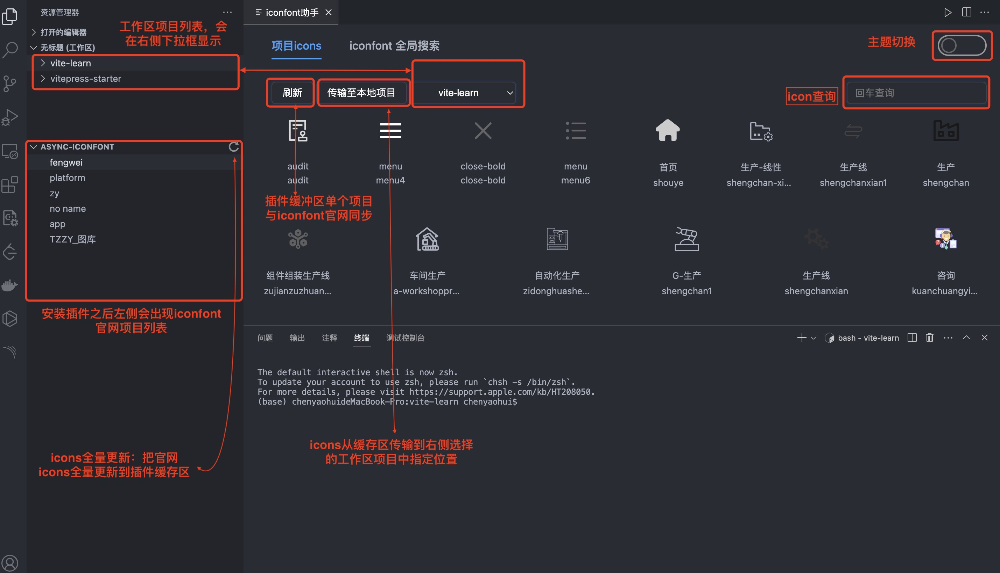
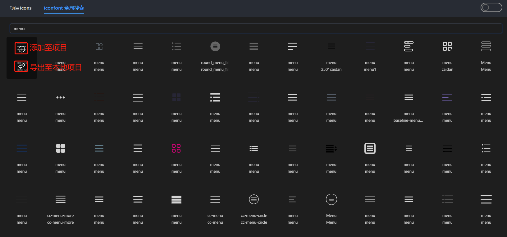
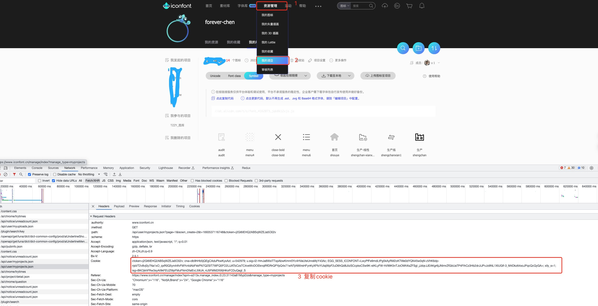
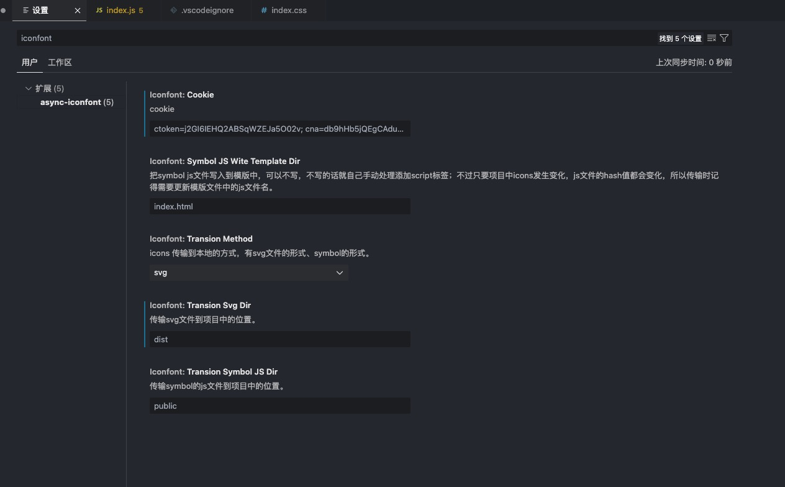

# async-iconfont

# 插件功能简述

* 
* 官网iconfont搜索并直接添加到项目中
  

# 传输方式

## 第一种方式：将iconfont官网单个项目中的icon svg图标以文件的形式导入到项目中指定的目录

* 将svg传输指定的目录

## 第二种方式：[插件中symbol引用的使用方式，插件通过配置会自动把js文件传输到本地项目中，并把script标签插入到指定的模版文件中](https://www.iconfont.cn/help/detail?spm=a313x.manage_type_myprojects.i1.d8cf4382a.77b13a81pEzUTj&helptype=code)

* 将symbol js文件传输到指定目录，文件hash值根据文件内容生成：内容发生变化hash值变化，内容不变，hash值不变
* 配置js文件插入模版；如果未设置，则不会进行script标签插入操作

# 插件配置方式简介

## 登录iconfont

* 进入这个[地址](https://www.iconfont.cn/)，然后注册或登录账号。

## cookie复制

* 

## 插件配置方式(有两种配置方式)

* 第一种在vscode配置中找到插件进行配置
  
* 第二种方式在项目根目录下新建配置文件：.iconfont.json

```
.iconfont.json配置示例
{
	"transionMethod":"svg|symbol",		// 插件使用方式
	"transionSvgDir":"src/assets/icons",	// svg方式传输icons到项目中指定的文件夹
	"transionSymbolJsDir":"src/assets/",	// symbol方式传输js文件到指定的文件夹
	"symbolJsWiteTemplateDir":"template/index.html"		// 把symbol js文件插入到html模版中
}
```
