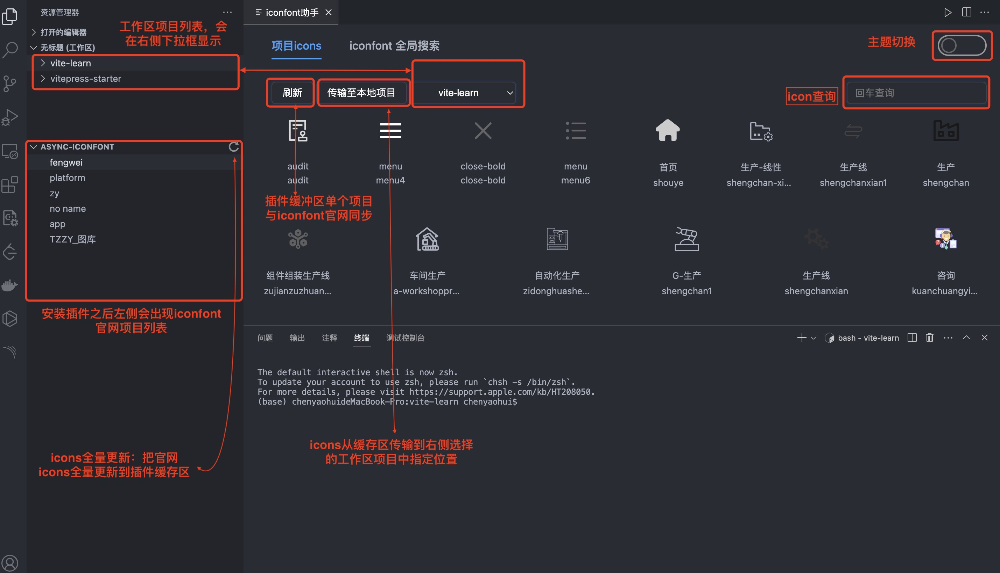
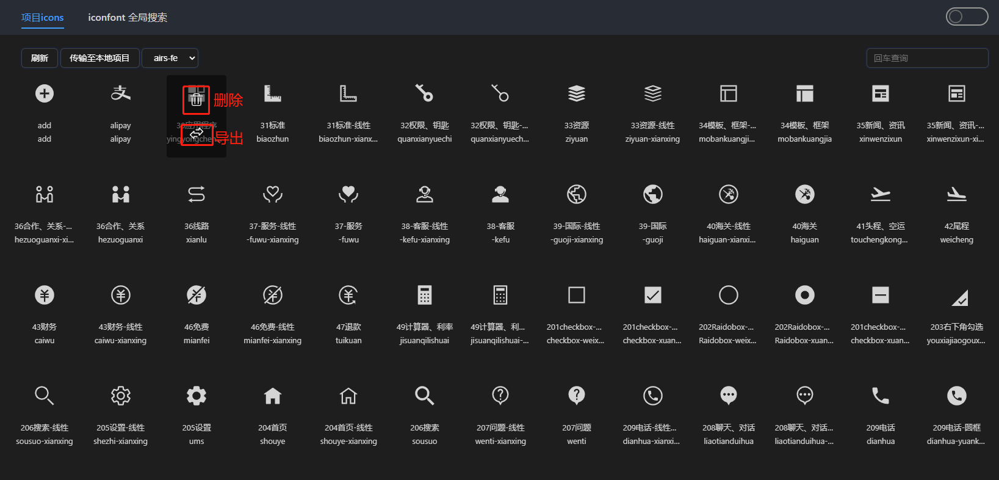
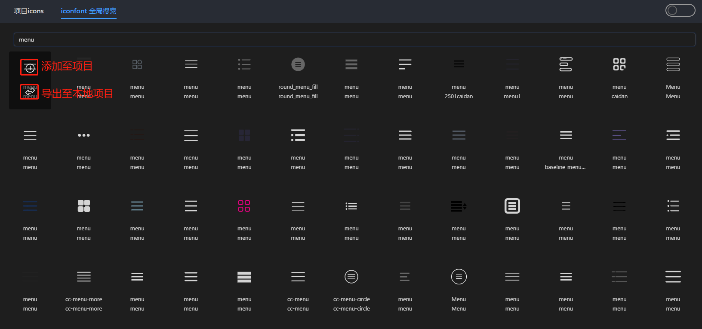
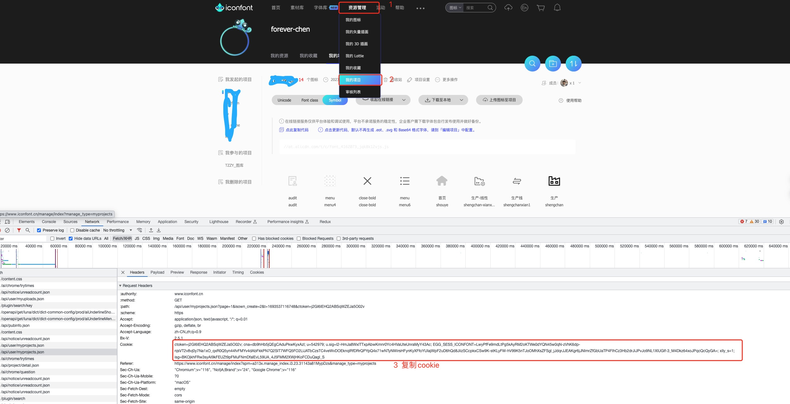
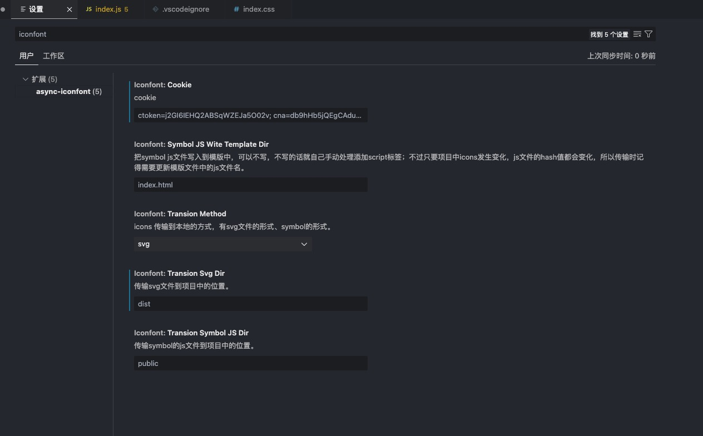

# async-iconfont

# 插件功能简述

async-iconfont插件的目的，主要是为了更便捷使用 [iconfont](https://www.iconfont.cn/) 中的项目图标。插件的功能主要包括：

1. 展示iconfont的项目图标仓库，并且可以删除、添加和搜索项目中的图标;
2. 可搜索iconfont的所有图标，并且添加至iconfont项目中;
3. 可导出图标至本地，主要分为两种方式：一、svg文件形式；二、官网推荐的 [symbol引用](https://www.iconfont.cn/help/detail?spm=a313x.manage_type_myprojects.i1.d8cf4382a.77b13a81pEzUTj&helptype=code) 方式;

以下是插件界面功能展示：


删除项目中的图标和导出单个图标至本地项目：


搜索iconfont官网图标并直接添加到项目中、也可直接导出单个图标至本地项目：


# 插件使用方式

### 第一种：svg图标
将iconfont官网单个项目中的icon图标以svg文件的形式导入到本地项目中指定的目录（默认在src/assets/icons目录下），本地项目可直接使用svg图标也可自行封装svg组件引用图标。

### 第二种：symbol引用
插件中 [symbol引用](https://www.iconfont.cn/help/detail?spm=a313x.manage_type_myprojects.i1.d8cf4382a.77b13a81pEzUTj&helptype=code) 的使用方式，插件通过配置会自动把js文件传输到本地项目中指定目录（默认在public目录下），并把script标签插入到指定的模版文件中（默认在index.html中）。

* 将symbol的js文件传输到指定目录，文件名根据文件内容生成hash值：内容发生变化hash值变化，内容不变，hash值不变。
* 配置js文件以script形式插入html模版，如果未设置，则不会进行标签插入操作。

# 插件配置方式简介

### 1. 登录iconfont

进入[iconfont官网](https://www.iconfont.cn/)，然后注册或登录账号。

### 2. cookie复制



### 3. 插件配置（两种方式）

### 第一种：User Settings
在vscode的用户配置（User Settings）中找到插件进行配置。


### 第二种：本地项目加配置文件
在本地项目根目录下新建iconfont配置文件：文件名【.iconfont.json】。

```
.iconfont.json 配置示例
{
	"transionMethod":"svg|symbol",		// 插件使用方式
	"transionSvgDir":"src/assets/icons",	// svg方式传输icons到项目中指定的文件夹
	"transionSymbolJsDir":"src/assets/",	// symbol方式传输js文件到指定的文件夹
	"symbolJsWiteTemplateDir":"template/index.html"		// 把symbol js文件插入到html模版中
}
```
